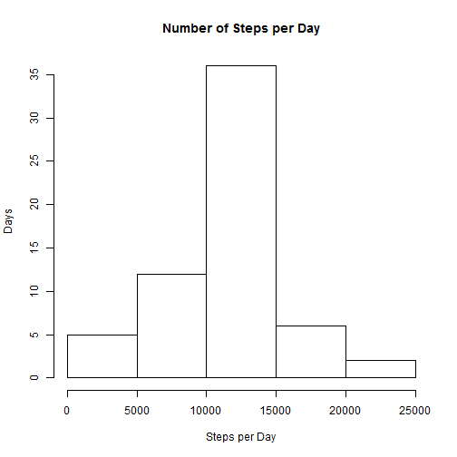

Setting Working directory


Unzipping the base data


Reading in the Data csv data


Loading the Correct R Packages for the Data Analysis


Adding the number of steps for each day 


Creating a histogram of the steps each day. 
 


Determine the mean and median of the steps taken in a day and ignoring the NAs.


```
## [1] "Mean"
```

```
## [1] 10766.19
```

```
## [1] "Median"
```

```
## [1] 10765
```


Making a plot of the daily activity pattern
 
The maximum Number of Steps occurs at interval

```
## [1] 835
```


Determining the number of NAs in the data set

Number of NAs


```
## [1] 2304
```

The NAs will be replaced with the average value for the time interval from the entire dataset.


```
## Warning in title(main = main, sub = sub, xlab = xlab, ylab = ylab, ...):
## "Main" is not a graphical parameter
```

```
## Warning in axis(1, ...): "Main" is not a graphical parameter
```

```
## Warning in axis(2, ...): "Main" is not a graphical parameter
```

 


Determining the Mean and Median of the new dataset.

Mean with imputed Values:

```r
b3
```

```
## [1] 10766.19
```
Median with imputed Values:

```r
b4
```

```
## [1] 10766.19
```

The new median and average are for all practical purposes the same. The average
is the same, but the median is a bit diffrent.  After imputation, there are 8
additional days of data, so all the bins of the histogram increase in frequency.
The distribution of the histogram does not appear to change significantly.

Creating the factor variable for weekday or Weekend for the dataset.


Now sorting the dataset into weekdays and weekends


Finding the average number of steps per interval for weekdays and weekends


Plotting the graph with both weekday and Weekend data
 

